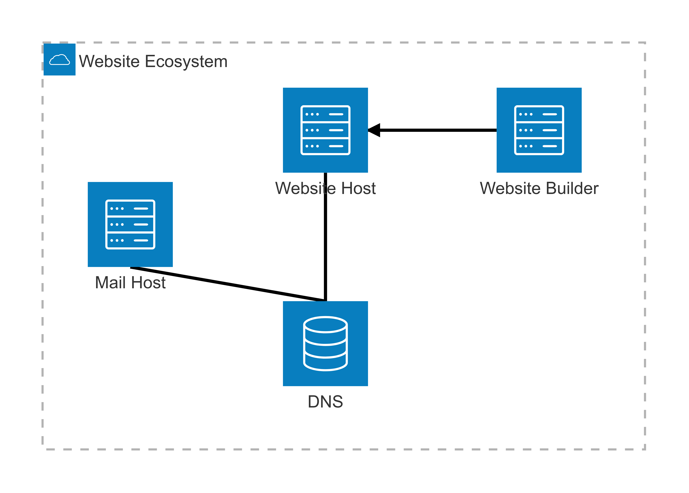

> blurred text is nerdy stuff, you can hover over it to be able to see it
# on website hosting
In 2025, there are many options for building websites - they differ on price, user-friendliness, and flexibility. In this document I will try to outline every viable option for hosting and building a website. All prices in this document are probably wrong.

## Decisions, decisions
I am going to delve a little bit into the details of every option, but if you're just here to be told what to do, please consult this flowchart:

<figure>
  
  <figcaption>Fig.1 - Flowchart for choosing a website builder/host</figcaption>
</figure>

A few notes:
- dynamic means that the content is different for each person depending on certain facts (e.g. logging in, changing settings, etc.)
- static means the content is the same across all users (still including different pages though)
- The static site generator are things like jekyll or netlify (Jekyll could be hosted on github pages which would be free)

### How they get you ($$$)
When researching most of these options, the payments can be quite confusing.

> For example, 'fasthosts' email hosting boasts a £1/month for two mailboxes, which is a fantastic deal! But this is only for the first 12 months, after which it is £2.40 per month.

It is important to consider there are nuances in prices that may be situation-specific (e.g. getting a cheap domain for one year instead of a good price for many). Any prices listed here are of the 'settled-in' price (i.e. after the cheap period).

### Understanding the ecosystem
When creating a website, there are 4 parts to consider: DNS Registrar, Website Builder, Website Host, and Mail Host. It is possible for one application (e.g. wix) to do all of these together, but they can be more expensive (because people pay for convenience).

<!-- 
architecture-beta
    group api(cloud)[API]

    service dns(database)[DNS] in api
    service website_builder(server)[Website Builder] in api
    service website_host(server)[Website Host] in api
    service mail_host(server)[Mail Host] in api
    
    dns:T -- B:mail_host
    dns:T -- B:website_host
    website_builder:L --\> R:website_host
-->

The basic ecosystem works such that the DNS links to the mail host and website host, and the website builder is used for the user to create the website that is then hosted on the website hosting service:

<figure>
  
  <figcaption>Fig.2 - Diagram of the general website ecossystem (most website providers can do all of these)</figcaption>
</figure>

It is not *that* much hassle to setup these services independently, and once they are configured there is little to no maintenance required. It is my opinion that the cost benefit greatly exceeds the effort to understand the technologies, but that may be my bias.

## Domain Name (DNS) Registrars
The 'domain name' is the main part of the address used to access your website, for example, google's domain name is '**google.com**'. Domain names vary in price (cars.com sold for $872 million 🤯)

- 123 Reg
    - was £0.79 for first year, subsequently £14.39/yr
- Squarespace
    - £16/yr
- ~~Google Domains~~ (discontinued)
- GoDaddy
    - £0.01 for first year, subsequently £12.99 minimum 3 year contract
- Namecheap
    - £5.98/yr
- domain.com
    - £6.99/yr
- fasthosts
    - £0.49 for 1 year, subsequently £12.99/yr

All of these DNS registrars allow you to fully manage the DNS records, hence you can route the domain name to any website host you pick. It basically doesn't matter which one of these you pick, it's up to you!

## Website building / hosting

- Squarespace
    - £12/month
    - The builder requires a little knowledge
    - Hosts the website
    - routing from DNS is easy if using squarespace dns
- Google Sites
    - £0/month (completely free!)
    - The builder requires basically no learning
    - Hosts the website
    - routing from DNS is a little tricky
- Wordpress
    - £ depends on host
    - Requires a little more learning
    - Incredibly flexible
    - Can be hosted using:
        - Bluehost (£8.99/month)
        - Wordpress (£20/month)
        - WP Engine (£40/month)
        - fasthosts (£6/month)
- Wix Sites
    - £9/month
    - The builder requires a little knowledge
    - Hosts the website
    - routing from DNS is easy if using squarespace dns
- GitHub Pages
    - £0/month
    - This is a funny one, it's a very good tool to generate a site for a project/wiki from scratch or templates
    - more developer-oriented (may be complex)

Google sites is a really great option to use if flexibility and complexity are irrlelevent - there are many limitations, but for clean-looking static websites, the limitations are probably worse the nonexistent cost.

I would say the cheapest for the 'power' is wordpress, with fasthosts as the server host.

## Custom emails
If you want to have an email @yourdomain (e.g. matthew@nohumanman.com), then you will need some kind of email host to support this.

- 123 reg
    - offers 1 mailbox for £1.99/month
- Microsoft 365
    - £6.99/user/month
- Google Workspace
    - £6/user/month
- fasthosts.com
    - standard email ~£2.40/month/inbox
- self-hosted
    - you could self-host your own mail server, which in my opinion is far too much effort for the cost. There are issues like spam, mailbox size, and most importantly - **server reliability**. Can you afford to lose an email? If you're confident, go for it!

Some of these may be more appealing if web-based email is important for your uses, but if you're just going to use an email client, the main difference will be mailbox size.

## Summary, I guess
This document is a pretty good rundown of the major options in the game. It's benefical for me as well as I am currently writing in a markdown document that I am exporting to html and then putting on github pages. Definitely not the smartest option and not something I would recommend - if I were to consult the flowchart here, I would end up with a static site generator, like Jekyll, which I'd be interested in using - if it lets me use html I could do cool things like have the option to blur out rambly nerdy stuff like this paragraph unless asked 🤓 

